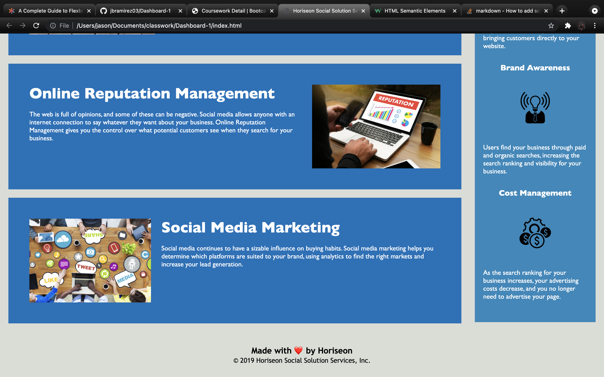

<h1 align="center">Dashboard-1</h1> 
  
[LinkedIn]: https://www.linkedin.com/in/jason-barrera-ramirez-b2a473204/

[MIT]: https://choosealicense.com/licenses/mit/
## Summary
This is a front-end project that deals with Html and CSS in order to create a functional website with working navbar links to different sections in the webpage.
## Table of Contents
- [Credits](#credits)
- [License](#license)
- [Technologies](#technologies)
- [Future development](#future-development)
- [How to contribute](#how-to-contribute)
- [Questions](#questions)
- [Link](#link)

## Functionality Screenshots

## Credits
Jason Barrera-Ramirez  
[][LinkedIn]  
## License
This Project is covered by the [MIT] license
## Technologies
[html]: https://developer.mozilla.org/en-US/docs/Web/HTML
[css]: https://developer.mozilla.org/en-US/docs/Web/CSS
[][html]
[][css]  
## Features
This webpage includes nicely formatted images aswell as working navbar links, the main focus is to be able to showcase skills with html and css.
## Future Development
A path this webpage is headed is being able to add a contact form and have a node/Js running in the backend.
## How to Contribute
Fork the Repo and make a pull request for code to be reviewed and considered for merge to main branch.
## Questions
If there are any questions about the project get in contact with me at my [Email](mailto:jason1287712@gmail.com)
## Link 
This is the link to the live site: [Github Page](https://jbramirez03.github.io/Dashboard-1/)